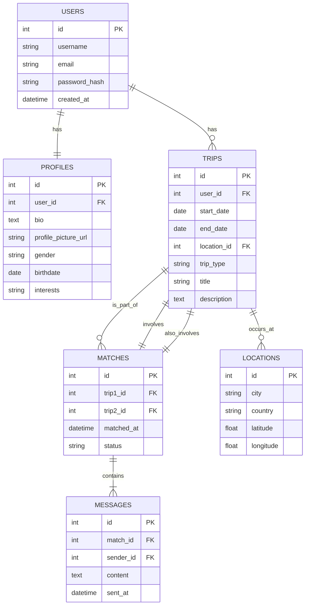

# Terava

## Récupérer le projet

```bash
git clone https://github.com/nota2k/terava.git
```

## Prérequis

### Installer Composer
Si Composer n'est pas installé, suivez les instructions sur le site officiel :  
[https://getcomposer.org/download/](https://getcomposer.org/download/)

### PHP
Assurez-vous que PHP est installé en version 8.2 ou supérieure.
Pour vérifier la version de PHP :
``php -v``

### Installer Laravel CLI
```bash
composer global require laravel/installer
```

### NodeJS
Assurez-vous que NodeJS est installé en version 18 ou supérieure.
``node -v``

Pour changer de version, on liste les versions existantes :
``nvm list``
puis
``nvm use v<numero de version>``

## Installation

1. Installez les dépendances PHP et JavaScript :
    ```bash
    composer install
    npm install && npm run build
    ```

2. Installer Docker, l'ouvrir et lancez le `docker-compose` pour démarrer le serveur MySQL et PhpMyAdmin :
    ```bash
    docker compose up
    ```

3. Créer le fichier ``.env`` en copiant le contenu de ``.env.example``

Il faut aussi générer une clef unique d'application via artisan, qui remplira la variable APP_KEY= :
    ``php artisan key:generate``

    > **Note :** Ces variables sont spécifiques à l'environnement local et ne sont pas incluses dans le dépôt. En production, elles sont configurées selon les informations fournies par l'hébergeur.

4. Effectuez une migration initiale pour tester la base de données avec Artisan, le CLI de Laravel :
    ```bash
    php artisan migrate
    ```

## Lancer le projet

Pour démarrer le projet, exécutez :
```bash
docker compose up -d
composer run dev
```
Le projet se lance sur par défaut sur ``http://127.0.0.1:8000/``

## Pour lancer une première migration
```bash
php artisan migrate
```
## Lancer Reverb

Pour lancer Reverb, il faut entrer dans le terminal cette commande: 
php artisan reverb:start --host=0.0.0.0 --port=8081

## Lancer Reverb
Pour lancer Reverb vous devez executer cette commande dans le terminal
```bash
php artisan reverb:start --host=0.0.0.0 --port=8081
```

## Pour générer des fake data
Les données sont préformatées dans les Factories, FakerPHP va générer de fausses données via ses propres fonctions. On peut retrouver l'ensemble des fonctions dans https://fakerphp.org/
Puis pour seeder la base de données avec les fausses data :
```
php artisan migrate:fresh --seed
```

##Swagger
Le Swagger est une documentation API qui permet de tester les différents endpoints (routes) sans passer par Postman par exemple. Le fonctionnement du Swagger est détaillé ici : https://zircote.github.io/swagger-php/guide/examples.html#controllers-petcontroller-php
Pour que le swagger fonctionne, il faut déclarer chaque endpoints dans le Controller et déclarer les propriétés dans chaque Model. Le Swagger va générer un api-doc.json qui contient tous les schemas qui ont été générés. Ces schemas vont permettre au Swagger de récupérer les propriétés de chaque Class et de pouvoir les utiliser dans les requêtes/réponses.
L'accès à la documentation de l'API se trouve ici : http://127.0.0.1:8000/api/documentation

Pour générer le Swagger :
```bash
php artisan l5-swagger:generate
```
##Troubleshooting 

En cas de message d'erreur lors de la première migration de la DB :
``  SQLSTATE[HY000] [1698] Access denied for user 'terava'@'localhost' (Connection: mysql, SQL: select exists (select 1 from information_schema.tables where table_schema = schema() and table_name = 'migrations' and table_type in ('BASE TABLE', 'SYSTEM VERSIONED')) as `exists`)``

Il faut basculer le ``DB_HOST=127.0.0.1`` et ``localhost`` ou inversement et recommencer la migration


# terava-back
# terava-back
# terava-back
